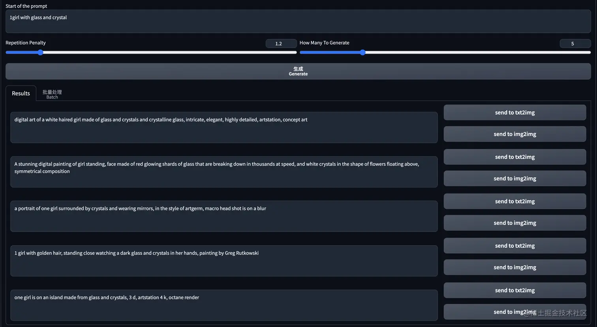
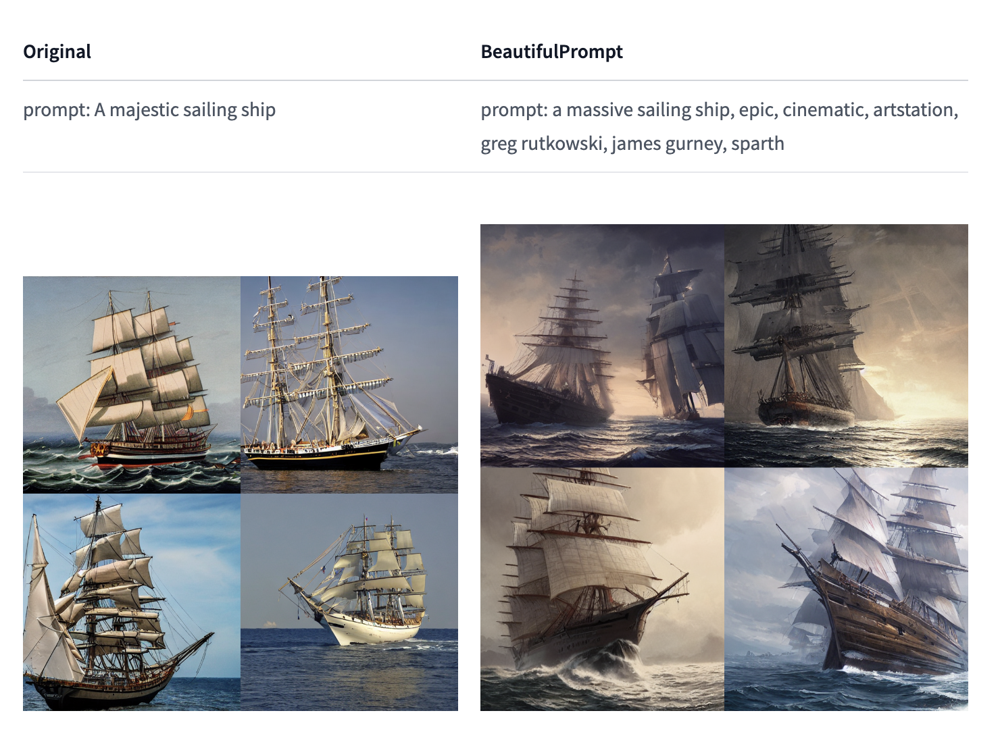

# stable-diffusion-prompt-pai

 generate a good stable diffusion prompt by alibaba-pai

## Installation

1. Install [AUTOMATIC1111's Stable Diffusion Webui](https://github.com/SoftMeng/stable-diffusion-prompt-pai)
2. Clone this repository into the `extensions` folder inside the webui

## Usage

1. Write in the prompt in the *Start of the prompt* text box
2. Click Generate and wait

The initial use of the model may take longer as it needs to be downloaded to your machine for offline use. 

The rendering effect of the 'Prompt' generated using '1Girl with glass and crystal' is as follows

Chinese: 使用`1girl with glass and crystal`生成的`Prompt`的出图效果如下

## Parameters Explanation

- **Start of the prompt**: As the name suggests, the start of the prompt that the generator should start with
- **Repetition Penalty**: The parameter for repetition penalty. 1.0 means no penalty. Default setting is 1.2
- **How Many To Generate**: The number of results to generate

## Thanks

https://huggingface.co/alibaba-pai/pai-bloom-1b1-text2prompt-sd

## 微信

